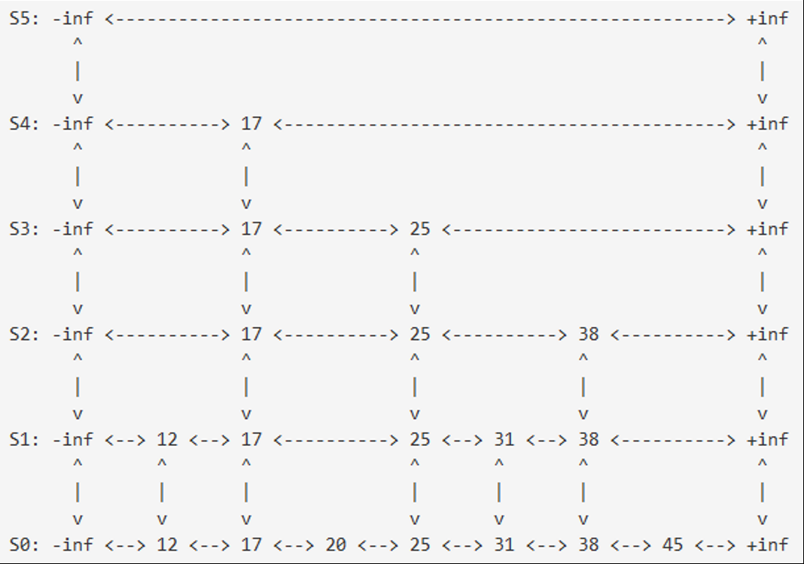
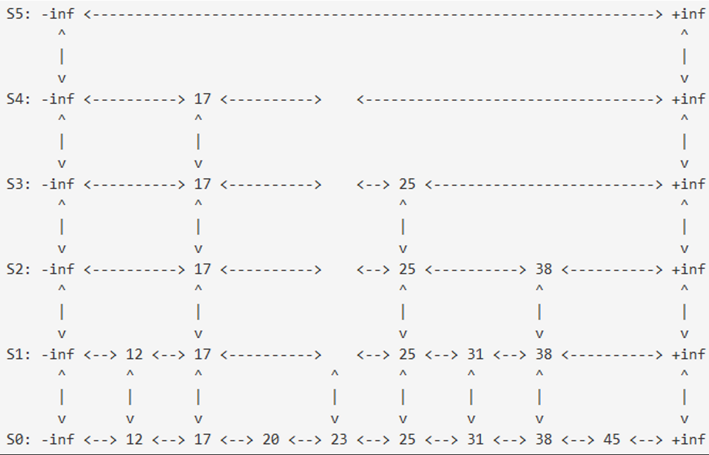

# Purpose
In this assignment you will implement a skip list and compare its performance against the performance of the doubly-linked and the MTF list you implemented/used in Lab 5.

# Skip List
The skip list is a sorted list whose find( ) function is bounded by O( log n ) on average. The figure below shows a level-6 skip list consisting of six parallel lists.  The lowest list includes all items in a sorted order. Middle lists inherit items from the immediate lower-level list with a 50% probability. The top list includes no items. All these lists' left and right-most items are "dummy items" storing a negative and positive infinitive respectively.



## The find() Algorithm
Given a value to search for, the find( ) function starts with the left most dummy item of the top level list, (e.g., see -inf in S5 in Figure 1 above), and repeats the following steps until it reaches the item at the lowest list that includes the given value:

1. Look at the item to the right of the current item. From the starting point of -inf on S5, the item to the right is +inf on S5. While that item's value is less than the item that is being searched for, move right. Otherwise, move onto the next step.

2. Look at the item one row lower down. If it exists, move down. If it doesn't exist and the current elements value is not equal to the value that is being searched for, the value is not in the list (return false). If the current elements value is equal to the value that is being searched for, return true. Otherwise, go back to step 1.

For instance, in order to find item 31, traverse from S5's -inf through S4's -inf, S4's 17, S3's 17, S3's 25, S2's 25, S1's 25, S1's 31, and S0's 31. 
There are two methods in this implementation:  find( ) and searchPointer( ): 

``` C++
template<class Object>
bool SList<Object>::find( const Object &obj )
  // points to the level-0 item close to a given object
    SListNode<Object> *p = searchPointer( obj );

    return ( p->next != NULL && p->item == obj );     // true if obj was found
}

/* return a pointer to the item whose value == objor return a pointer to the first item whose value > obj if we can't find  the exact item.*/
template<class Object>
SListNode<Object> *SList<Object>::searchPointer( const Object &obj ) {
    SListNode<object> *p = header[Level - 1]; // start from the top left
    // implement your codes here
    
    return p;
}
```

## insert() algorithm
Given a new object to insert, the insert( object ) function starts with calling searchPointer( object ). 
If searchPointer( value ) returns a pointer to the exact item, we don't have to insert this value. 
Otherwise, start inserting this item just in front of (i.e., on the left side of) what searchPointer( object ) has returned. 
After inserting the item at the lowest level, (i.e., at S0), you have to repeat the following steps:
1. Calls rand( ) % 2 to decide whether the same item should be inserted in a one-level higher list. Insert when rand( ) % 2 returns 1, otherwise stop the insertion.
2. To insert the same new item in a one-level higher list, move left toward -inf at the current level until encountering an item that has a link to the one-higher level list.
3. Shift up to the same item in the next higher list.
4. Move right just one time, (i.e., to the next item).
5. Insert the new item in front of the current item.

For instance, to insert item 23, you have to go to item 25, insert 23 in front of 25, and then call rand( ) % 2 to decide if you need to insert the same item in the next higher list. If it returns 1, you have to traverse S0's 20, S0's 17, S1's 17, and S1's 25. Insert 23 before item 25. Repeat the same sequence of operations to insert 23 on S2, S3, and S4. However, don't insert any items at the top level, (i.e., S5).



## Delete Algorithm
Given an object to delete, the remove( object ) function starts with calling searchPointer( object ). If searchPointer( value ) returns a pointer to the exact item, we delete this item from the lowest up to the highest level as repeatedly traversing a pointer from the current item to its above item. For instance, to delete item 17, start its deletion from S0's 17, simply go up to S1's 17, delete it, and repeat the same operations till you delete S4's 17.
