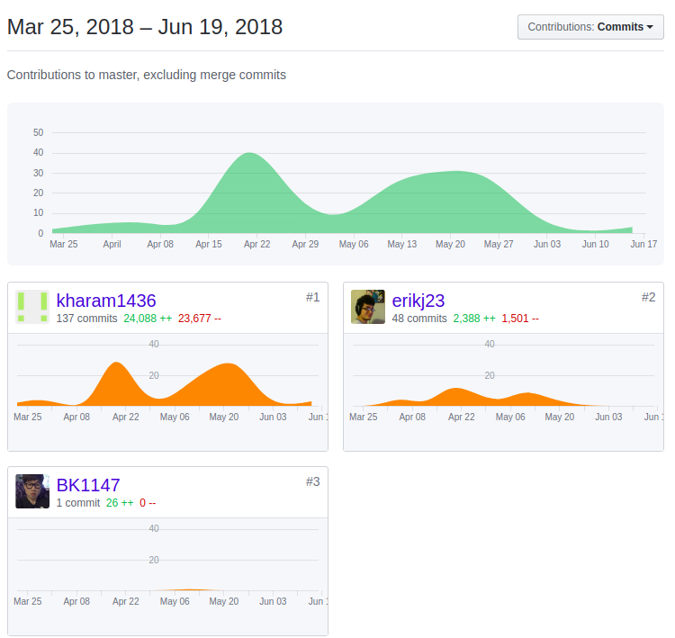

# Intro
This is done as course work in University of Washington Bothell CSS422. (Architecture and Hardware)

# Code Contribution
Three people worked as a group, and there were three roles.
- I/O: Resposible for Intro message, and getting input from user, and validate, and save the value into a variable.
- OPCODE : Resposible for decoding logic.
- Effective Address: Resposible for memory management, and printout out operands

## My role
My role in the team was <b><u>Opcode</b></u>, and <b><u>Effective Address</b></u>.
- My Code start after user put the input into the console, and press enter.
- Disassemble.x68 (Line# 292 ~ 3254) <b>(100% disassemble Logic)</b>




# What this repository includes
- Executable File
- Source code for the file ('Disassemble.x68')
- Test Code ('Test_Code.x68', 'demo_test.X68').

# List of Instruction decode
```
ADDI         
SUBI          
MOVE.B
MOVE.L
MOVEA.L
MOVE.W
MOVEA.W
CLR
NOP
RTS
JSR
MOVEM
LEA
ADDQ
BCC
BGT
BLE
MOVEQ
OR
DIVU
SUB
CMP
AND
MULS
MULU
ADD
ADDA
ASR
ASL
LSR
LSL
ROR
ROL
```

# How to use
- load the program with easy 68k
- Go to file->opendata
- Open(load) demo_test.s68
- Run
# Example output


# Feed Bback from Our instructor (Wooyoung Kim)
```
- Your program is almost perfect except the following error: -1
==============================
From the data,
ED2F   

Your program print as
LSR.B	D6,D7

Which should be printed as LSL.B D6, D7
===============================
```
## Minor fix
```
I fix the issue and now the code is working perfectly.
```