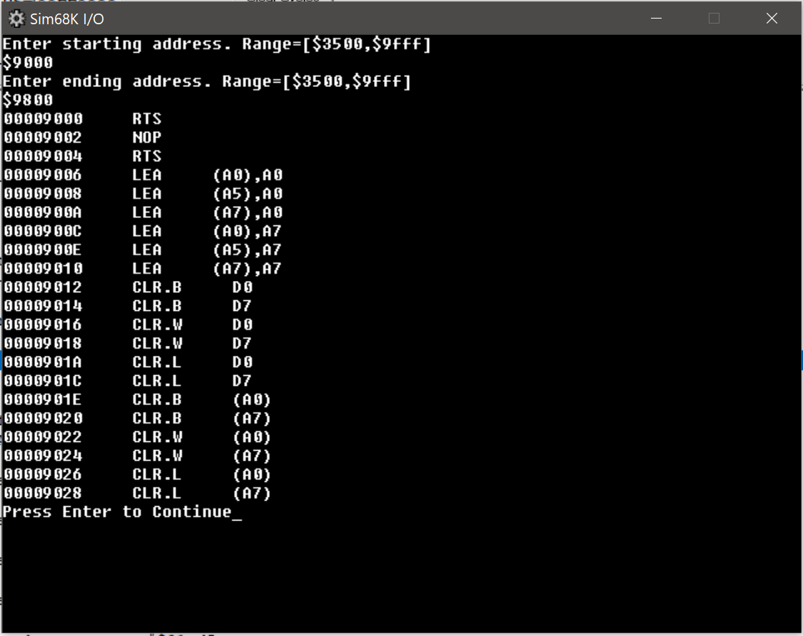

# Intro
This is done as course work in University of Washington Bothell CSS422. (Architecture and Hardware)

# Code Contribution
Three people worked as a group, and there were three roles.
- I/O: Resposible for Intro message, and getting input from user, and validate, and save the value into a variable.
- OPCODE : Resposible for decoding logic.
- Effective Address: Resposible for memory management, and printout out operands

## My role
My role in the team was Opcode, and Effective Address.
- My Code start after user put the input into the console, and press enter.

# What this repository includes
- Executable File
- Encrypted Source Code
- Test Code.

# List of Instruction decode
```
ADDI         
SUBI          
MOVE.B
MOVE.L
MOVEA.L
MOVE.W
MOVEA.W
CLR
NOP
RTS
JSR
MOVEM
LEA
ADDQ
BCC
BGT
BLE
MOVEQ
OR
DIVU
SUB
CMP
AND
MULS
MULU
ADD
ADDA
ASR
ASL
LSR
LSL
ROR
ROL
```

# How to use
- load the program with easy 68k
- Go to file->opendata
- Open(load) demo_test.s68
- Run
# Example output
