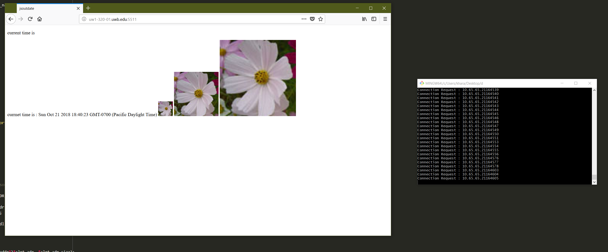
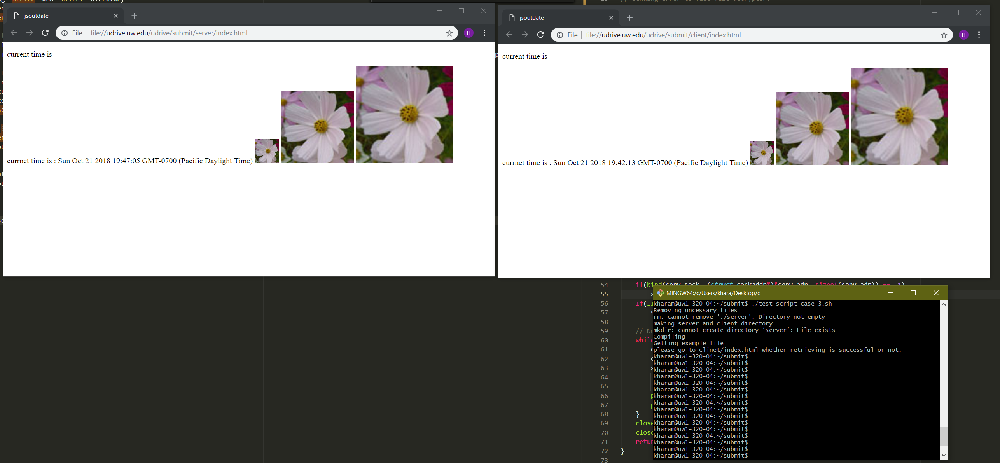
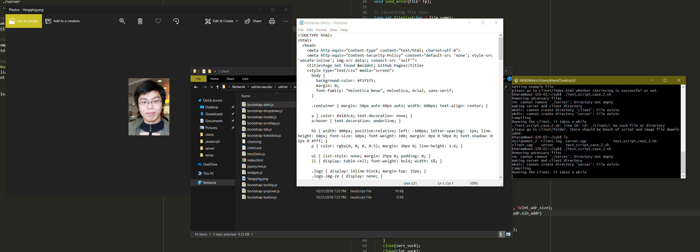

# Simplified HTTP Retriever and Server
This programs simulate HTTP server, and client.

## server
The server will use multi-thread technic to accept the multipe connection from the client, so that it can handle multiple concurrent connection from the client.

## client
The clinet will get the index.html file from the server, and read the file html file line by line, and find picture files, and javascript file to download. If the pciture files, and javasciprt file exist in foreign webpage, the client make a new connection to the origin site and download them.

# cases
 In order to test the protocol, I tried three different cases.
 
 1. A real web browser accessing my server
    - I run my program on uw intranet with my laptop in order to see the result
    

 1. my client accessing my server
    - Test my server and client whether they can communicate each other.
    
 1. my client accessing real server
    - My client program accessing the real server, I use the website [caffe author](http://daggerfs.com/)
    

# Operating system
* Ubuntu 16.04 (GCC 5)
* Debian 9.6 (GCC 6)

# Protocol
Use standard non-presistent HTTP (1.0) used for both server and client.

# Limitation
My client program does not care about the comment. As a result, in index.html, although a picture file is comment, the clinet program will still try to download the picture.