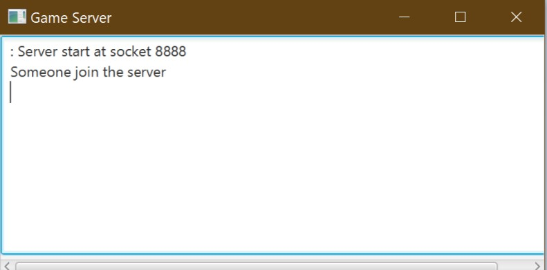
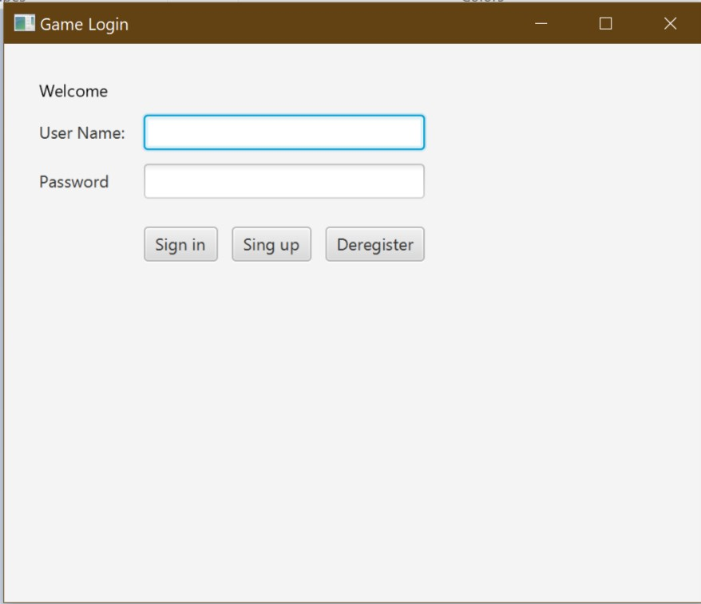
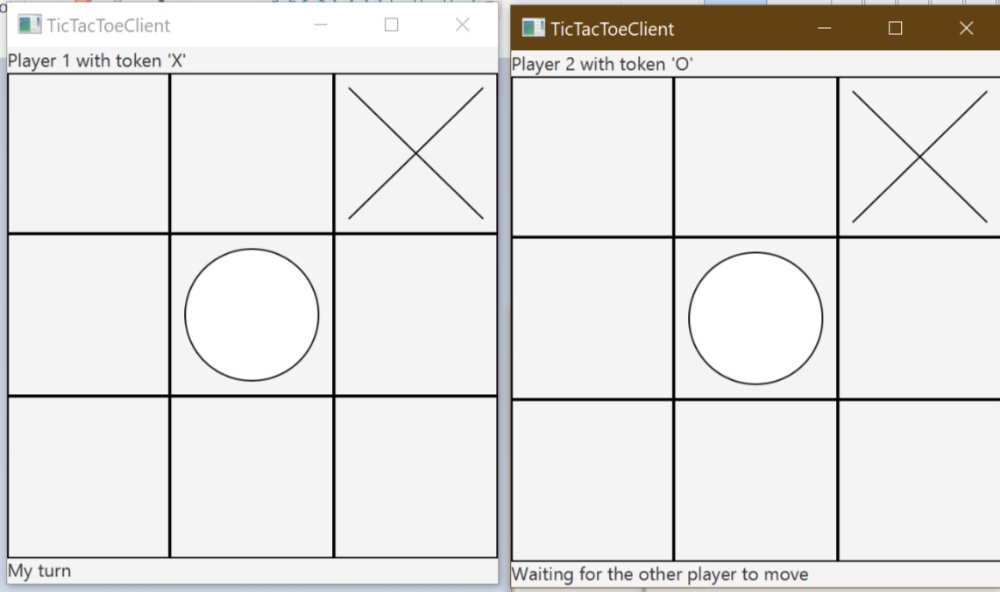

# tictaktoe

# Documentation
CSS 432 Computer Networking 
Term Project: Tic Tac Toe 
Gihwan Kwon, Haram Kwon 

# Overall Description
*	This is multiplayer ‘Tic Tac Toe’ game utilizing client and server network 
  architecture. The codes were written in Java under oracle JDK version 1.8.0 191.

# Protocols
*	The application protocols defined in the Message Control Interface; 
    * Following lists are the defined protocols for the administrative and the game protocols. Transmission Control Protocol (TCP) is used for the transport layer. This is implemented in Java’s object and the data socket stream.
*	Sign Up 
    * Sign up request = 2; 
    *	sign up success = 103; 
    *	Sign up fail = 104;  
*	Sign In
    *	Sign in request = 1; 
    *	Sign in success = 101; 
    *	Sign in fail = 102; 
*	Room List   	
    *	Room List Request = 5; 
    *	Room List Response = Room List Object; 
*	Create Game 
    * Create Room Request = 3;
    *	Create Room Success = 105; 
    *	Create Room Fail = 106;  
*	Join Game 
    *	Join Room Request = 4; 
    *	Join Room Success = 107; 
    *	Join Room Fail = 108; 
*	Exit Game 
    *	 close = 0; 
*	Unregister 
*	Tic Tac Toe Protocol 
    *	Player 1 = 10; 
    *	Player 2 = 20; 
    *	Player1_won = 30; 
    *	Player2_won = 40; 
    *	Draw = 50; 
    *	continue = 60; 
*	Error = -1; 

# Compilation
*	javac gameserver.java
*	javac client_main.java

# Overall Demo
1.	Turn on the Server (run Server.jar)
2.	Turn on the Client (run Client.jar)
3.	Client Sign up 
4.	Client Sign in 
5.	Check out the Room List (choose between)
    1.	Create Room (then wait)
    2.	Join Room 
6.	Game start (See the Game Demo) 
7.	Game over back to Number 5 

# Game Demo
*	When two users enter the game, the room is closed, so no other user can enter the room
*	Player_1 will be assigned as ‘x’, and player_2 will be assigned as ‘o’, and the palyer_1 who is the creator of the room will play the game first
*	When Player_1 makes an action, the server gets the row and column information of Player_1, and the server gives the next turn to player_2. And then, player_2 now makes an action, and server gives the next turn to Player_1 again
*	When one of the players wins, the server notifies the winner to both player_1, and player_2

* Server demo with image.

* Client demo with image.

* Game play with image.
